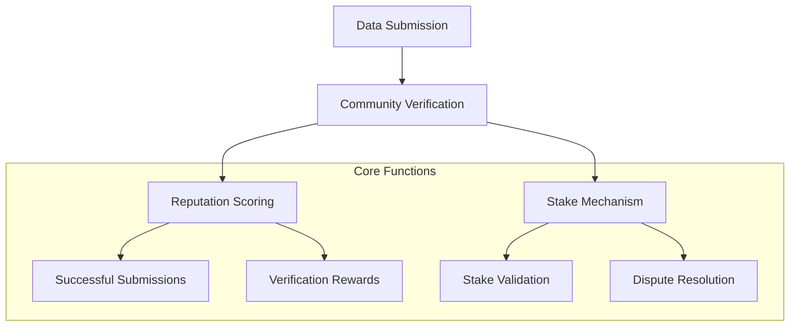

# P2P Network Data Scraper

A decentralized platform for community-driven network data collection and verification built on the Stacks blockchain.

## Overview

P2P Network Scraper eliminates centralized data collection bottlenecks by enabling a collaborative, trustless environment for gathering and validating network insights. The platform enables:

- Community members to submit network data
- Stake-based verification mechanism
- Reputation tracking for data contributors
- Transparent and incentivized data collection
- Secure, decentralized validation process

## Architecture



The system consists of several interconnected components:
1. Network Data Submission
2. Community-Driven Verification
3. Reputation Tracking
4. Incentive Mechanism
5. Dispute Handling

## Contract Documentation

### Network Data Submissions
- Managed through `network-data-submissions` data map
- Stores network data details, submission status, and stakes
- Functions include:
  - `submit-network-data`
  - `verify-network-data`

### User Reputation
- Tracked in `user-reputation` data map
- Manages contributor credibility and performance
- Calculates reputation based on successful submissions

### Verification Process
- Uses `data-verifications` data map
- Enables community members to validate submitted data
- Implements stake-based verification mechanism

## Getting Started

### Prerequisites
- Clarinet CLI
- Stacks wallet
- STX tokens for transactions and staking

### Installation
1. Clone the repository
2. Install dependencies with Clarinet
3. Deploy contracts to your chosen network

### Basic Usage

1. **Submit Network Data**
```clarity
(contract-call? 
  .network-data-scraper 
  submit-network-data 
  "bandwidth-usage" 
  "mainnet-2023" 
  "{ 'total_bandwidth': 1024, 'peak_time': '14:30' }" 
  u2000 ;; Stake amount
)
```

2. **Verify Network Data**
```clarity
(contract-call? 
  .network-data-scraper 
  verify-network-data 
  u1 ;; submission-id
  true ;; Verification result
  (some "Data looks accurate") ;; Optional comment
)
```

## Function Reference

### Public Functions

#### Data Submission
- `submit-network-data`: Submit new network data
- `verify-network-data`: Verify submitted network data

#### Reputation Management
- User reputation automatically tracked and updated

### Read-Only Functions
- `get-submission`: Retrieve submission details
- `get-user-reputation`: Check contributor reputation

## Development

### Testing
Run tests using Clarinet:
```bash
clarinet test
```

### Local Development
1. Start Clarinet console:
```bash
clarinet console
```
2. Deploy contracts
3. Interact using contract calls

## Security Considerations

### Verification Mechanism
- Minimum stake required for data submission
- Stake acts as a quality assurance bond
- Verifiers can claim stakes for invalid submissions

### Reputation System
- Dynamic reputation scoring
- Encourages high-quality data contributions
- Discourages malicious or low-quality submissions

### Best Practices
- Submit accurate and verifiable network data
- Stake responsibly
- Verify data thoroughly
- Maintain a good reputation score

### Incentive Structure
- 10% reward for successful data submissions
- Stake returned for valid data
- Stake transferred to verifier for invalid data